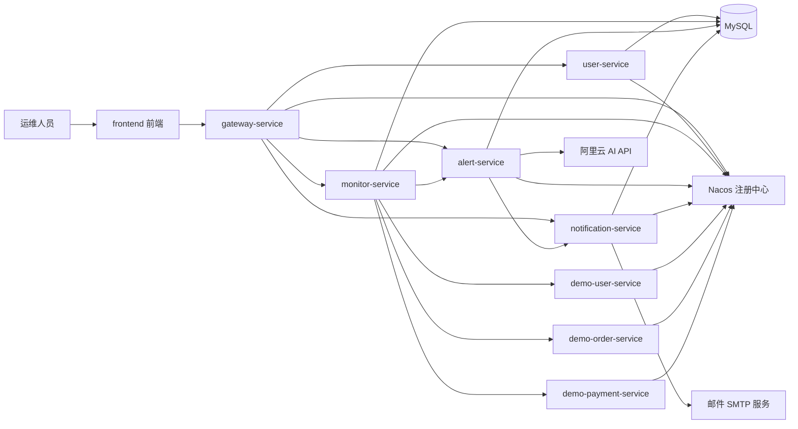

# 《AI 运维助手》PRD（升级版）

## 1. 项目概述

### 1.1 项目名称

AI 运维助手

### 1.2 项目简介

AI 运维助手是一个面向运维人员的微服务系统，用于自动监控模拟业务微服务运行状态，发现异常后自动生成告警，并通过 AI 对异常原因进行诊断。

系统支持服务状态监控、告警规则配置、告警去重与抑制、异步 AI 诊断、告警生命周期管理、邮件通知、通知记录查询和前端可视化展示。

用户登录后，可以查看服务状态、告警列表、告警详情、AI 诊断结果、告警处理记录，并可以配置告警规则和邮件通知地址。

### 1.3 项目目标

- 展示 Spring Cloud Alibaba 微服务架构
- 实现服务状态自动监控
- 支持告警阈值规则配置化
- 实现异常指标判断与告警生成
- 支持告警去重与抑制，避免重复刷屏
- 支持 AI 异步诊断和诊断结果回写
- 支持邮件通知能力，并记录通知发送结果
- 支持告警生命周期管理和状态变更记录
- 提供前端页面展示服务状态、告警、AI 诊断报告和配置项
- 支持 Docker Compose 一键部署演示

### 1.4 目标用户

运维人员。

系统不区分 admin / operator，不做用户分级和角色权限控制。所有登录用户拥有相同系统操作能力。

---

## 2. 总体架构设计

### 2.1 系统架构图



### 2.2 服务拆分

| 服务 | 主要职责 |
|---|---|
| gateway-service | 系统统一入口、JWT 鉴权、路由转发、限流保护 |
| user-service | 用户登录、账号校验、JWT 生成 |
| monitor-service | 服务健康检查、指标采集、阈值规则判断、异常上报 |
| alert-service | 告警生成、告警去重、异步 AI 诊断、告警状态管理、告警历史查询 |
| notification-service | 邮件通知配置、邮件发送、通知记录保存和查询 |
| demo-user-service | 模拟用户业务服务 |
| demo-order-service | 模拟订单业务服务 |
| demo-payment-service | 模拟支付业务服务 |
| frontend | 前端页面展示和用户操作入口 |

---

## 3. 核心业务流程

### 3.1 用户登录流程

1. 用户在前端登录页输入账号和密码。
2. 前端调用 gateway-service。
3. gateway-service 将登录请求转发到 user-service。
4. user-service 校验账号密码。
5. 校验成功后生成 JWT。
6. 前端保存 JWT。
7. 后续请求通过请求头携带 JWT。
8. gateway-service 统一完成 JWT 鉴权。
9. JWT 合法时，请求被转发到对应后端服务。

说明：

- user-service 仅负责用户登录和 JWT 生成。
- 系统不返回用户角色。
- 系统不区分 admin / operator。

### 3.2 自动监控与规则判断流程

1. monitor-service 定时轮询被监控微服务。
2. 被监控微服务包括 demo-user-service、demo-order-service、demo-payment-service。
3. monitor-service 调用各服务的 `/health` 接口获取在线状态。
4. monitor-service 调用各服务的 `/metrics` 接口获取运行指标。
5. monitor-service 从 `alert_rule` 表读取启用状态的告警规则。
6. 根据服务名称、指标名称、比较符、阈值、持续时间判断是否触发告警。
7. 当指标异常时，monitor-service 调用对应服务的 `/test/error` 接口获取异常日志片段。
8. monitor-service 将异常指标快照、命中的规则和日志片段发送给 alert-service。
9. monitor-service 保存服务指标历史和最新服务状态。
10. 前端定时刷新服务状态首页。

说明：

- 阈值不写死在代码中，而是通过 `alert_rule` 表配置。
- 支持 CPU、内存、错误率、响应时间、服务在线状态等指标规则。
- 可以通过前端“告警配置页”修改规则。

### 3.3 告警去重与抑制流程

为避免同一异常在短时间内重复生成大量告警，alert-service 需要支持告警去重和抑制。

1. alert-service 接收 monitor-service 上报的异常数据。
2. 根据 `serviceName + alertType + metricName` 生成告警指纹 `fingerprint`。
3. 查询是否存在相同指纹且未结束的告警。
4. 如果不存在，则创建新告警。
5. 如果已存在，则不重复创建新告警，只更新原告警的触发次数、最后触发时间、最新指标快照和日志片段。
6. 如果同一告警在抑制时间窗口内重复触发，只记录触发次数，不重复通知。

示例：

```text
demo-order-service 的 ERROR_RATE_HIGH 在 5 分钟内重复出现：
不新增多条告警，只更新 trigger_count 和 last_triggered_at。
```

### 3.4 异步 AI 诊断流程

原流程中，创建告警后立即同步调用 AI，可能导致接口响应变慢。升级后改为异步诊断。

1. alert-service 创建或更新告警。
2. 告警创建后，诊断状态初始化为 `PENDING`。
3. alert-service 使用异步线程池执行 AI 诊断任务。
4. 诊断任务开始后，诊断状态变为 `RUNNING`。
5. 调用阿里云 AI API。
6. 如果调用成功，保存真实 AI 诊断结果，诊断状态变为 `SUCCESS`。
7. 如果调用失败、超时或返回异常格式，生成 Mock 诊断结果，诊断状态变为 `MOCKED`。
8. 诊断结果回写到告警记录。
9. 诊断完成后，alert-service 调用 notification-service 判断是否需要发送邮件。
10. 前端在告警详情页展示诊断状态和诊断结果。

诊断状态包括：

| 状态 | 说明 |
|---|---|
| PENDING | 等待诊断 |
| RUNNING | 诊断中 |
| SUCCESS | AI 诊断成功 |
| FAILED | 诊断失败 |
| MOCKED | 使用 Mock 诊断结果 |

### 3.5 邮件通知流程

邮件通知能力独立为 notification-service。

1. alert-service 在告警创建或 AI 诊断完成后调用 notification-service。
2. notification-service 查询启用状态的邮件通知配置。
3. 根据告警严重等级和配置中的最低通知级别判断是否需要发送邮件。
4. 如果满足条件，组装邮件标题和正文。
5. notification-service 通过 SMTP 发送邮件。
6. 发送成功或失败后，保存通知记录到 `notification_record` 表。
7. 前端可以查看邮件通知配置和发送记录。

说明：

- 当前版本只支持邮件通知。
- 不接入钉钉、飞书、企业微信 Webhook。
- 邮箱账号和授权码通过环境变量配置，不写死在代码中。

### 3.6 告警生命周期流程

告警不再只有“未处理、处理中、已解决”三个状态，而是支持更完整的处理状态。

| 状态 | 说明 |
|---|---|
| UNHANDLED | 未处理 |
| PROCESSING | 处理中 |
| RESOLVED | 已解决 |
| IGNORED | 已忽略 |
| FALSE_ALARM | 误报 |
| RECOVERED | 已恢复 |

流程：

1. 告警首次创建后状态为 `UNHANDLED`。
2. 用户开始处理后，可改为 `PROCESSING`。
3. 问题解决后，可改为 `RESOLVED`。
4. 如果告警不需要处理，可改为 `IGNORED`。
5. 如果判断为误报，可改为 `FALSE_ALARM`。
6. 如果系统检测到指标恢复正常，可自动标记为 `RECOVERED`。
7. 每次状态变更都写入 `alert_status_history` 表。

---

## 4. 功能说明

### 4.1 用户登录功能

| 功能 | 输入 | 处理逻辑 | 输出 / 效果 |
|---|---|---|---|
| 用户登录 | 账号、密码 | user-service 校验账号密码，生成 JWT | 登录成功返回 JWT |
| JWT 鉴权 | JWT | gateway-service 校验 JWT 是否有效 | 合法请求转发，非法请求拒绝 |
| 退出登录 | 无 | 前端清除本地 JWT | 回到登录页 |

### 4.2 服务状态监控功能

| 功能 | 输入 | 处理逻辑 | 输出 / 效果 |
|---|---|---|---|
| 定时指标采集 | 无 | monitor-service 轮询 `/health` 和 `/metrics` | 获取服务运行指标 |
| 规则读取 | 无 | 查询 `alert_rule` 中启用的规则 | 得到当前生效的告警规则 |
| 阈值判断 | 指标 + 规则 | 根据规则判断是否异常 | 正常或异常状态 |
| 异常日志片段收集 | 异常服务 | 调用 `/test/error` | 获取日志片段 |
| 异常上报 | 指标快照、规则、日志片段 | OpenFeign 调用 alert-service | 创建或更新告警 |
| 服务状态更新 | 监控结果 | 保存最新服务状态和历史指标 | 前端展示服务卡片和趋势数据 |

### 4.3 告警规则配置功能

告警规则用于控制“什么情况下产生告警”。

| 功能 | 说明 |
|---|---|
| 规则查询 | 查询所有告警规则 |
| 新增规则 | 新增某服务某指标的告警规则 |
| 修改规则 | 修改阈值、严重等级、持续时间等配置 |
| 启停规则 | 控制规则是否生效 |
| 删除规则 | 删除不再使用的规则 |

规则字段包括：服务名称、指标名称、比较符、阈值、持续时间、严重等级、是否启用。

### 4.4 告警管理功能

| 功能 | 输入 | 处理逻辑 | 输出 / 效果 |
|---|---|---|---|
| 告警生成 | 异常指标、日志片段、规则信息 | alert-service 创建告警 | 新告警状态为 UNHANDLED |
| 告警去重 | 告警指纹 | 判断是否已有相同未结束告警 | 避免重复创建 |
| 告警抑制 | 抑制时间窗口 | 重复触发时只更新次数 | 避免重复通知 |
| 告警列表查询 | 筛选条件 | 查询告警记录 | 返回告警列表 |
| 告警详情查询 | 告警 ID | 查询告警、诊断、状态历史、通知记录 | 返回完整详情 |
| 告警状态修改 | 告警 ID、状态、备注 | 更新状态并记录历史 | 状态变更成功 |
| 历史记录查询 | 时间、服务、状态 | 查询历史告警 | 返回历史列表 |

### 4.5 AI 诊断功能

| 功能 | 说明 |
|---|---|
| 异步诊断 | 告警创建后后台执行 AI 诊断 |
| Prompt 组装 | 根据服务、指标、日志、历史告警生成诊断提示词 |
| 结构化输出 | 要求 AI 返回 JSON 格式诊断结果 |
| 诊断回写 | 将诊断结果保存到告警记录 |
| Mock 兜底 | AI API 失败时生成 Mock 诊断结果 |

AI 诊断结果字段示例：

```json
{
  "faultType": "接口错误率过高",
  "rootCause": "订单服务运行时异常导致错误率升高",
  "impactScope": ["demo-order-service"],
  "suggestionSteps": [
    "检查订单创建接口异常日志",
    "检查数据库连接是否正常",
    "确认最近是否有发布变更"
  ],
  "rollbackSuggestion": "如果异常由最近发布引起，建议回滚到上一稳定版本",
  "severity": "HIGH",
  "confidence": 0.82,
  "needManualHandle": true,
  "diagnosedAt": "2026-05-08 10:00:05",
  "source": "ALIYUN_AI"
}
```

### 4.6 AI 诊断提示词设计

AI 诊断 Prompt 包含以下输入：

- 服务名称
- 告警类型
- 告警严重等级
- 指标快照
- 异常日志片段
- 最近触发次数
- 最近触发时间
- 相关历史告警

Prompt 要求 AI 输出结构化 JSON，包含故障类型、根因分析、影响范围、处理步骤、回滚建议、严重等级、置信度和是否需要人工介入。

示例 Prompt：

```text
你是一个运维故障诊断助手，请根据以下告警信息分析故障原因。

服务名称：demo-order-service
告警类型：ERROR_RATE_HIGH
严重等级：HIGH
指标快照：errorRate=12.3%, responseTime=520ms, cpu=85.2%
异常日志：java.lang.RuntimeException: order create failed...
最近触发次数：3

请只返回 JSON，不要返回额外解释。
```

### 4.7 邮件通知功能

| 功能 | 说明 |
|---|---|
| 邮件配置查询 | 查询接收邮箱和最低通知级别 |
| 新增邮件配置 | 新增接收邮箱 |
| 修改邮件配置 | 修改邮箱、最低通知级别、启用状态 |
| 删除邮件配置 | 删除不再使用的邮箱配置 |
| 发送邮件通知 | 告警达到通知条件时发送邮件 |
| 记录发送结果 | 保存成功、失败或跳过原因 |
| 通知记录查询 | 查询邮件发送历史 |

邮件通知标题示例：

```text
【HIGH 告警】demo-order-service 错误率过高
```

邮件正文示例：

```text
服务名称：demo-order-service
告警类型：ERROR_RATE_HIGH
严重等级：HIGH
当前状态：UNHANDLED
AI 诊断：订单服务运行时异常导致错误率升高
处理建议：检查订单创建逻辑、数据库连接和最近发布记录
触发时间：2026-05-08 10:00:05
```

### 4.8 接口返回格式统一

所有接口统一返回以下结构：

```json
{
  "code": 0,
  "message": "success",
  "data": {}
}
```

错误返回示例：

```json
{
  "code": 401,
  "message": "JWT 已过期或无效",
  "data": null
}
```

常用错误码：

| code | 含义 |
|---|---|
| 0 | 成功 |
| 400 | 参数错误 |
| 401 | 未登录或 Token 无效 |
| 404 | 资源不存在 |
| 500 | 系统异常 |
| 1001 | 告警状态非法 |
| 1002 | 告警规则不存在 |
| 2001 | AI 诊断失败，已使用 Mock |
| 3001 | 邮件发送失败 |

---

## 5. 页面 / 模块说明

### 5.1 登录页

- 账号输入框
- 密码输入框
- 登录按钮
- 登录失败提示

### 5.2 服务状态首页

页面内容：

- 总服务数
- 异常服务数
- 未处理告警数
- 服务状态卡片列表

服务状态卡片字段：

- 服务名称
- CPU 使用率
- 内存使用率
- 错误率
- 响应时间
- 在线状态
- 最近更新时间

可扩展展示：CPU 趋势、内存趋势、错误率趋势、响应时间趋势。

### 5.3 告警列表页

页面内容：

- 告警列表
- 告警状态筛选
- 服务名称筛选
- 严重等级筛选
- 时间范围筛选

告警列表字段：

- 告警 ID
- 服务名称
- 告警类型
- 严重等级
- 当前状态
- 诊断状态
- 触发次数
- 创建时间
- 最近触发时间
- 更新时间

### 5.4 告警详情 / AI 诊断报告页

页面内容：

- 告警基础信息
- 指标快照
- 异常日志片段
- AI 诊断状态
- AI 诊断结果
- 当前处理状态
- 状态修改控件
- 状态变更记录
- 邮件通知记录

### 5.5 告警配置页

告警配置页分为两个 Tab。

#### Tab 1：告警规则配置

字段：服务名称、指标名称、比较符、阈值、持续时间、严重等级、是否启用。

支持操作：新增规则、修改规则、启用 / 停用规则、删除规则。

#### Tab 2：邮件通知配置

字段：接收邮箱、最低通知级别、是否启用。

支持操作：新增邮箱配置、修改邮箱配置、启用 / 停用配置、删除配置。

### 5.6 通知记录查看

通知记录可以在告警详情页中展示，也可以提供简单的通知记录查询入口。

字段：告警 ID、接收邮箱、邮件标题、发送状态、失败原因、发送时间。

---

## 6. 微服务详细设计

### 6.1 gateway-service

职责：

- 系统统一入口
- JWT 鉴权
- 请求路由
- 限流保护
- 转发前端请求到后端微服务

路由目标：user-service、monitor-service、alert-service、notification-service。

要求：

- 集成 Spring Cloud Gateway
- 集成 Nacos 服务发现
- 支持基于 JWT 的统一鉴权
- `/login` 接口加入白名单
- 其他接口需要携带合法 JWT

### 6.2 user-service

职责：用户登录、用户账号校验、JWT 生成。

要求：

- 支持预置账号登录
- 密码使用 BCrypt 加密存储
- 登录成功返回 JWT 和过期时间
- 不返回角色信息
- 不做用户分级

### 6.3 monitor-service

职责：

- 定时轮询被监控微服务
- 获取健康状态和运行指标
- 从 `alert_rule` 读取告警规则
- 判断异常指标
- 收集异常日志片段
- 向 alert-service 上报告警数据
- 提供最新服务状态查询接口
- 提供告警规则配置接口

要求：

- 调用被监控服务 `/health`
- 调用被监控服务 `/metrics`
- 异常时调用 `/test/error`
- 接口调用使用 Sentinel 保护
- 阈值配置不写死在代码中

### 6.4 alert-service

职责：

- 接收 monitor-service 上报的异常数据
- 生成告警指纹
- 告警去重和抑制
- 创建或更新告警记录
- 异步调用阿里云 AI API
- 保存 AI 或 Mock 诊断结果
- 管理告警状态
- 保存告警状态变更记录
- 查询告警列表、详情和历史
- 调用 notification-service 触发邮件通知

要求：

- 告警首次创建时状态为 `UNHANDLED`
- 重复告警不重复创建
- AI 诊断不阻塞告警创建接口
- AI 失败时使用 Mock 诊断结果
- 状态修改需要写入 `alert_status_history`

### 6.5 notification-service

职责：

- 邮件通知配置管理
- 根据告警严重等级判断是否需要发送邮件
- 发送邮件通知
- 保存邮件通知记录
- 查询邮件通知记录

要求：

- 只支持邮件通知
- 邮件 SMTP 账号、密码、服务地址通过环境变量配置
- 每次发送成功或失败都保存记录
- 发送失败不影响告警主流程

### 6.6 被监控微服务

包括 demo-user-service、demo-order-service、demo-payment-service。

职责：模拟业务服务，提供健康检查接口、运行指标接口、模拟异常日志接口和慢接口。

接口：`/health`、`/metrics`、`/test/error`、`/test/slow`。

---

## 7. 接口设计

### 7.1 用户接口

#### 7.1.1 用户登录

```http
POST /login
```

请求参数：

```json
{
  "username": "ops",
  "password": "123456"
}
```

返回数据：

```json
{
  "code": 0,
  "message": "success",
  "data": {
    "token": "jwt-token",
    "expiresIn": 7200
  }
}
```

### 7.2 服务监控接口

#### 7.2.1 查询最新服务状态

```http
GET /monitor/services
```

返回数据：

```json
{
  "code": 0,
  "message": "success",
  "data": [
    {
      "serviceName": "demo-order-service",
      "cpu": 85.2,
      "memory": 70.5,
      "errorRate": 12.3,
      "responseTime": 520,
      "status": "ABNORMAL",
      "timestamp": "2026-05-08 10:00:00"
    }
  ]
}
```

#### 7.2.2 查询服务指标历史

```http
GET /monitor/services/{serviceName}/metrics
```

请求参数：startTime、endTime。

### 7.3 告警规则接口

#### 7.3.1 查询告警规则

```http
GET /alert-rules
```

#### 7.3.2 新增告警规则

```http
POST /alert-rules
```

请求参数：

```json
{
  "serviceName": "demo-order-service",
  "metricName": "errorRate",
  "operator": ">",
  "threshold": 10,
  "durationSeconds": 60,
  "severity": "HIGH",
  "enabled": true
}
```

#### 7.3.3 修改告警规则

```http
PUT /alert-rules/{id}
```

#### 7.3.4 启用 / 停用告警规则

```http
PUT /alert-rules/{id}/enabled
```

请求参数：

```json
{
  "enabled": false
}
```

#### 7.3.5 删除告警规则

```http
DELETE /alert-rules/{id}
```

### 7.4 告警接口

#### 7.4.1 创建告警

```http
POST /alerts
```

调用方：monitor-service。

请求参数：

```json
{
  "serviceName": "demo-order-service",
  "alertType": "ERROR_RATE_HIGH",
  "metricName": "errorRate",
  "severity": "HIGH",
  "metricsSnapshot": {
    "cpu": 85.2,
    "memory": 70.5,
    "errorRate": 12.3,
    "responseTime": 520
  },
  "logSnippet": "java.lang.RuntimeException: order create failed..."
}
```

返回数据：

```json
{
  "code": 0,
  "message": "success",
  "data": {
    "alertId": 1001,
    "status": "UNHANDLED",
    "diagnosisStatus": "PENDING",
    "deduplicated": false
  }
}
```

#### 7.4.2 查询告警列表

```http
GET /alerts
```

请求参数：status、serviceName、severity、startTime、endTime。

#### 7.4.3 查询告警详情

```http
GET /alerts/{id}
```

返回内容包括：告警基础信息、指标快照、日志片段、AI 诊断状态、AI 诊断结果、状态变更记录、邮件通知记录。

#### 7.4.4 修改告警状态

```http
PUT /alerts/{id}/status
```

请求参数：

```json
{
  "status": "PROCESSING",
  "remark": "已开始排查订单服务异常"
}
```

### 7.5 邮件通知接口

#### 7.5.1 查询邮件通知配置

```http
GET /notification/configs
```

#### 7.5.2 新增邮件通知配置

```http
POST /notification/configs
```

请求参数：

```json
{
  "email": "ops@example.com",
  "minSeverity": "HIGH",
  "enabled": true
}
```

#### 7.5.3 修改邮件通知配置

```http
PUT /notification/configs/{id}
```

#### 7.5.4 删除邮件通知配置

```http
DELETE /notification/configs/{id}
```

#### 7.5.5 发送邮件通知

```http
POST /notifications/send
```

调用方：alert-service。

请求参数：

```json
{
  "alertId": 1001,
  "serviceName": "demo-order-service",
  "alertType": "ERROR_RATE_HIGH",
  "severity": "HIGH",
  "diagnosisSummary": "订单服务运行时异常导致错误率升高",
  "suggestion": "检查订单创建逻辑、数据库连接和最近发布记录"
}
```

#### 7.5.6 查询通知记录

```http
GET /notification/records
```

请求参数：alertId、email、status、startTime、endTime。

### 7.6 被监控服务接口

#### 7.6.1 健康检查

```http
GET /health
```

返回数据：

```json
{
  "status": "UP"
}
```

#### 7.6.2 指标查询

```http
GET /metrics
```

返回数据：

```json
{
  "cpu": 85.2,
  "memory": 70.5,
  "requestCount": 1200,
  "errorRate": 12.3,
  "responseTime": 520
}
```

#### 7.6.3 模拟异常日志

```http
GET /test/error
```

#### 7.6.4 模拟慢接口

```http
GET /test/slow
```

---

## 8. 数据库设计

### 8.1 用户表：users

| 字段名 | 类型 | 说明 |
|---|---|---|
| user_id | BIGINT，PK | 主键 |
| username | VARCHAR(100) | 用户名 |
| password | VARCHAR(255) | BCrypt 加密后的密码 |
| created_at | DATETIME | 创建时间 |
| updated_at | DATETIME | 更新时间 |

### 8.2 服务指标表：service_metrics

| 字段名 | 类型 | 说明 |
|---|---|---|
| id | BIGINT，PK | 主键 |
| service_name | VARCHAR(100) | 服务名称 |
| cpu | FLOAT | CPU 使用率 |
| memory | FLOAT | 内存使用率 |
| request_count | INT | 请求数 |
| error_rate | FLOAT | 错误率 |
| response_time | FLOAT | 响应时间 |
| status | VARCHAR(30) | UP / DOWN / ABNORMAL |
| timestamp | DATETIME | 采集时间 |

### 8.3 告警规则表：alert_rule

| 字段名 | 类型 | 说明 |
|---|---|---|
| id | BIGINT，PK | 主键 |
| service_name | VARCHAR(100) | 服务名称 |
| metric_name | VARCHAR(50) | 指标名称 |
| operator | VARCHAR(10) | 比较符，例如 >、>=、<、<= |
| threshold | DOUBLE | 阈值 |
| duration_seconds | INT | 持续时间 |
| severity | VARCHAR(30) | LOW / MEDIUM / HIGH / CRITICAL |
| enabled | TINYINT | 是否启用 |
| created_at | DATETIME | 创建时间 |
| updated_at | DATETIME | 更新时间 |

示例数据：

| service_name | metric_name | operator | threshold | duration_seconds | severity | enabled |
|---|---|---|---:|---:|---|---|
| demo-order-service | errorRate | > | 10 | 60 | HIGH | 1 |
| demo-order-service | cpu | > | 80 | 60 | MEDIUM | 1 |
| demo-payment-service | responseTime | > | 1000 | 60 | HIGH | 1 |

### 8.4 告警记录表：alerts

| 字段名 | 类型 | 说明 |
|---|---|---|
| alert_id | BIGINT，PK | 告警 ID |
| service_name | VARCHAR(100) | 服务名称 |
| alert_type | VARCHAR(100) | 告警类型 |
| metric_name | VARCHAR(50) | 指标名称 |
| severity | VARCHAR(30) | 严重等级 |
| status | VARCHAR(30) | 告警状态 |
| fingerprint | VARCHAR(255) | 告警指纹，用于去重 |
| trigger_count | INT | 触发次数 |
| metrics_snapshot | JSON | 指标快照 |
| log_snippet | TEXT | 异常日志片段 |
| diagnosis_status | VARCHAR(30) | 诊断状态 |
| diagnosis_result | JSON | AI 或 Mock 诊断结果 |
| first_triggered_at | DATETIME | 首次触发时间 |
| last_triggered_at | DATETIME | 最近触发时间 |
| recovered_at | DATETIME | 恢复时间 |
| created_at | DATETIME | 创建时间 |
| updated_at | DATETIME | 更新时间 |

### 8.5 告警状态历史表：alert_status_history

| 字段名 | 类型 | 说明 |
|---|---|---|
| id | BIGINT，PK | 主键 |
| alert_id | BIGINT | 告警 ID |
| from_status | VARCHAR(30) | 原状态 |
| to_status | VARCHAR(30) | 新状态 |
| operator | VARCHAR(100) | 操作人 |
| remark | VARCHAR(500) | 备注 |
| created_at | DATETIME | 创建时间 |

### 8.6 邮件通知配置表：notification_config

| 字段名 | 类型 | 说明 |
|---|---|---|
| id | BIGINT，PK | 主键 |
| email | VARCHAR(255) | 接收邮箱 |
| min_severity | VARCHAR(30) | 最低通知级别 |
| enabled | TINYINT | 是否启用 |
| created_at | DATETIME | 创建时间 |
| updated_at | DATETIME | 更新时间 |

### 8.7 邮件通知记录表：notification_record

| 字段名 | 类型 | 说明 |
|---|---|---|
| id | BIGINT，PK | 主键 |
| alert_id | BIGINT | 告警 ID |
| email | VARCHAR(255) | 接收邮箱 |
| title | VARCHAR(255) | 邮件标题 |
| content | TEXT | 邮件内容 |
| status | VARCHAR(30) | PENDING / SUCCESS / FAILED / SKIPPED |
| error_message | TEXT | 失败原因 |
| sent_at | DATETIME | 发送时间 |
| created_at | DATETIME | 创建时间 |

---

## 9. 异常处理

### 9.1 monitor-service 异常处理

| 场景 | 处理方式 |
|---|---|
| `/health` 调用失败 | 标记服务为 DOWN |
| `/metrics` 调用失败 | 返回默认指标并记录异常 |
| 被监控服务响应超时 | Sentinel 降级，避免阻塞轮询任务 |
| 日志片段获取失败 | 告警仍生成，日志片段可为空 |
| 规则查询失败 | 记录异常，本轮不触发新告警 |

### 9.2 alert-service 异常处理

| 场景 | 处理方式 |
|---|---|
| 告警保存失败 | 返回错误提示并记录日志 |
| 重复告警 | 更新已有告警，不重复创建 |
| AI API 调用失败 | 生成 Mock 诊断结果 |
| AI API 超时 | 生成 Mock 诊断结果 |
| AI API 返回异常格式 | 生成 Mock 诊断结果 |
| notification-service 调用失败 | 记录日志，不影响告警主流程 |
| 告警状态非法 | 返回参数错误 |
| 告警不存在 | 返回不存在提示 |

### 9.3 notification-service 异常处理

| 场景 | 处理方式 |
|---|---|
| 无启用通知配置 | 记录 SKIPPED 或不发送 |
| 告警级别低于最低通知级别 | 记录 SKIPPED |
| 邮件发送失败 | 保存 FAILED 记录和失败原因 |
| 邮箱格式非法 | 返回参数错误 |
| SMTP 配置缺失 | 保存 FAILED 记录 |

### 9.4 gateway-service 异常处理

| 场景 | 处理方式 |
|---|---|
| JWT 缺失 | 拒绝请求 |
| JWT 无效 | 拒绝请求 |
| JWT 过期 | 拒绝请求 |
| 后端服务不可用 | 返回统一错误提示 |

---

## 10. 关键日志 / 事件

系统需要记录以下关键日志：

- 用户登录成功 / 失败
- monitor-service 采集指标
- monitor-service 读取告警规则
- monitor-service 判断指标异常
- monitor-service 上报告警
- alert-service 创建告警
- alert-service 告警去重命中
- alert-service 异步诊断开始
- alert-service 调用阿里云 AI API
- alert-service 生成 Mock 诊断结果
- alert-service 回写诊断结果
- alert-service 调用 notification-service
- notification-service 发送邮件成功 / 失败
- 告警状态修改
- 数据库异常
- OpenFeign 调用异常
- Sentinel 降级事件

---

## 11. 安全细节

本项目只保留必要基础安全设计：

1. 用户密码使用 BCrypt 加密存储。
2. JWT 设置过期时间，例如 2 小时。
3. gateway-service 将 `/login` 设置为白名单，其余接口统一校验 JWT。
4. 阿里云 AI Key、邮箱账号、邮箱授权码通过环境变量配置，不写死在代码中。

---

## 12. 技术栈

### 12.1 后端

- Spring Boot 3.x
- Spring Cloud Alibaba
- Nacos
- Spring Cloud Gateway
- OpenFeign
- Sentinel
- MySQL
- JavaMailSender

### 12.2 前端

- Vue 3
- Element Plus
- Axios
- Vue Router

### 12.3 容器化

- Docker
- Docker Compose

### 12.4 AI 接口

- 阿里云 AI API

---

## 13. 部署说明

系统通过 Docker Compose 启动以下服务：

- nacos
- mysql
- gateway-service
- user-service
- monitor-service
- alert-service
- notification-service
- demo-user-service
- demo-order-service
- demo-payment-service
- frontend

环境变量示例：

```yaml
ALIYUN_AI_API_KEY: your-api-key
MAIL_HOST: smtp.example.com
MAIL_PORT: 465
MAIL_USERNAME: ops@example.com
MAIL_PASSWORD: your-mail-auth-code
JWT_SECRET: your-jwt-secret
```

启动后访问前端页面，完成登录、服务状态查看、告警查看、规则配置、邮件通知配置和 AI 诊断结果查看。

---

## 14. 演示场景

### 14.1 错误率过高

1. 调用 demo-order-service 的异常接口。
2. monitor-service 采集到 errorRate 超过规则阈值。
3. alert-service 创建 ERROR_RATE_HIGH 告警。
4. alert-service 异步生成 AI 诊断结果。
5. notification-service 根据 HIGH 级别发送邮件。
6. 前端展示告警详情、AI 诊断和邮件通知记录。

### 14.2 服务下线

1. 停止 demo-payment-service 容器。
2. monitor-service 调用 `/health` 失败。
3. 服务状态变为 DOWN。
4. 系统生成 SERVICE_DOWN 告警。
5. AI 诊断建议检查容器状态、Nacos 注册状态和服务日志。

### 14.3 响应时间过高

1. 调用 `/test/slow` 模拟慢接口。
2. responseTime 超过配置阈值。
3. 系统生成 RESPONSE_TIME_HIGH 告警。
4. AI 诊断建议检查慢接口、线程池和数据库查询。

### 14.4 重复告警抑制

1. 同一服务在短时间内持续异常。
2. 系统不重复创建多条告警。
3. 只更新原告警的触发次数和最近触发时间。
4. 邮件通知不重复刷屏。

---

## 15. 验收标准

### 15.1 登录与鉴权

- 用户可通过账号密码登录系统。
- 登录成功后 user-service 返回 JWT。
- 密码使用 BCrypt 加密存储。
- 前端请求后端接口时携带 JWT。
- gateway-service 能正确校验 JWT。
- `/login` 接口无需 JWT。
- 未登录或 JWT 无效时，请求被拒绝。
- 系统不区分 admin / operator。

### 15.2 服务监控

- monitor-service 能定时轮询被监控微服务。
- 能正确调用 `/health` 获取服务状态。
- 能正确调用 `/metrics` 获取 CPU、内存、错误率、响应时间等指标。
- 能保存服务指标历史数据。
- 被监控服务调用失败时，监控流程不会阻塞。

### 15.3 告警规则配置

- 前端可以查询告警规则列表。
- 前端可以新增、修改、删除告警规则。
- 前端可以启用或停用告警规则。
- monitor-service 能从 `alert_rule` 表读取规则。
- 指标超过启用规则阈值时能生成告警。
- 修改规则后，不需要改代码即可生效。

### 15.4 告警生成、去重和抑制

- alert-service 能接收 monitor-service 上报的异常数据。
- alert-service 能创建告警记录。
- 新告警状态默认为 `UNHANDLED`。
- 相同服务、相同告警类型、相同指标的重复告警不会重复创建。
- 重复触发时能更新 `trigger_count` 和 `last_triggered_at`。
- 告警抑制期间不会重复发送邮件。

### 15.5 AI 异步诊断

- 告警创建接口不会等待 AI 诊断完成。
- 告警创建后诊断状态为 `PENDING`。
- AI 诊断执行中状态为 `RUNNING`。
- AI API 调用成功后，诊断状态为 `SUCCESS`。
- AI API 调用失败、超时或异常时，系统能保存 Mock 诊断结果。
- 前端能展示诊断状态和诊断结果。
- AI 诊断结果包含故障类型、根因分析、影响范围、处理步骤、回滚建议和置信度。

### 15.6 告警生命周期

- 告警支持 `UNHANDLED`、`PROCESSING`、`RESOLVED`、`IGNORED`、`FALSE_ALARM`、`RECOVERED` 状态。
- 用户可以修改告警状态。
- 后端能校验非法状态值。
- 每次状态修改都会写入 `alert_status_history`。
- 告警详情页能展示状态变更记录。

### 15.7 邮件通知

- 系统包含独立的 notification-service。
- 前端可以配置接收邮箱、最低通知级别和启用状态。
- notification-service 能根据告警严重等级判断是否发送邮件。
- 达到通知条件时能发送邮件。
- 邮件发送成功时保存 SUCCESS 记录。
- 邮件发送失败时保存 FAILED 记录和错误原因。
- 告警详情页或通知记录页能查看邮件通知记录。
- 邮件发送失败不影响告警创建和 AI 诊断流程。

### 15.8 接口返回格式

- 所有后端接口统一返回 `code`、`message`、`data` 结构。
- 正常请求返回 `code = 0`。
- 异常请求返回对应错误码和错误信息。

### 15.9 页面验收

- 登录页可正常登录。
- 服务状态首页可展示服务状态卡片。
- 服务状态首页可自动刷新。
- 告警列表页可展示告警数据。
- 告警详情页可展示日志片段、AI 诊断结果、状态历史和通知记录。
- 告警配置页包含“告警规则配置”和“邮件通知配置”两个 Tab。
- 页面不展示 admin / operator 角色差异。

### 15.10 部署验收

- 系统可通过 Docker Compose 一键启动。
- Nacos、MySQL、Gateway、各微服务和前端均能正常启动。
- notification-service 能正常注册到 Nacos。
- 前端可正常访问。
- 服务之间可通过 Nacos 注册发现。
- OpenFeign 调用正常。
- Sentinel 限流和降级策略可生效。
- 阿里云 AI Key 和邮箱配置可通过环境变量注入。
